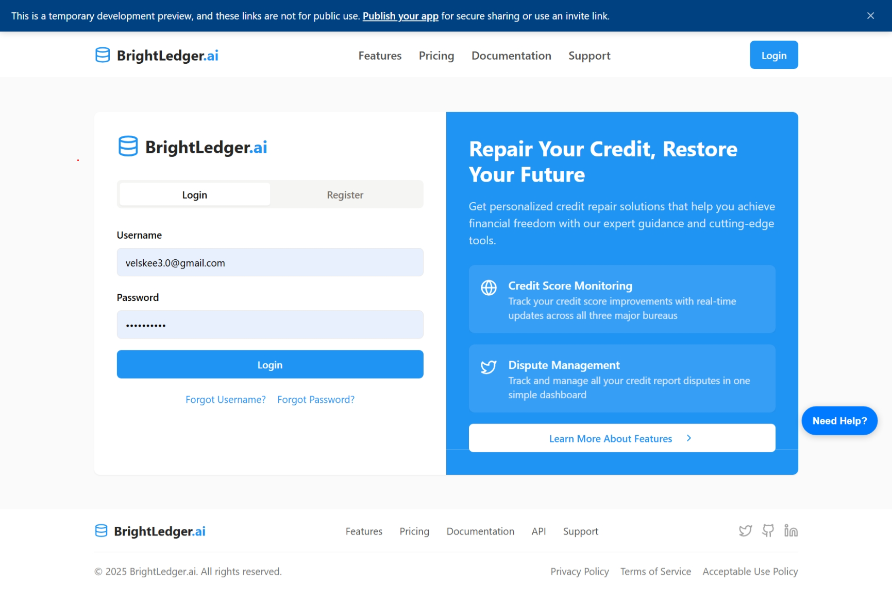
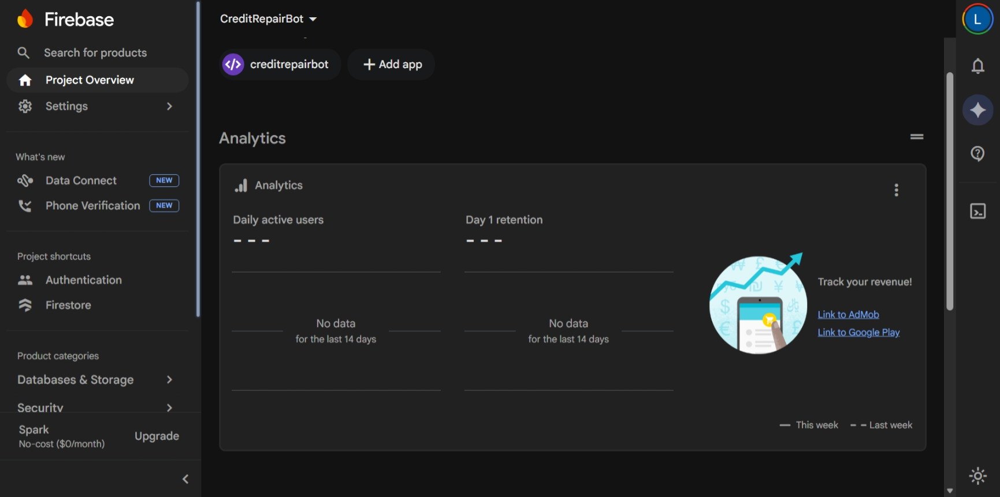
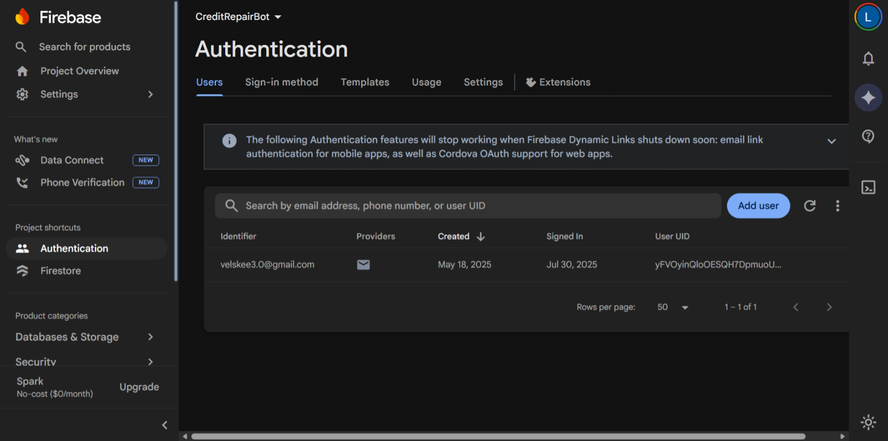
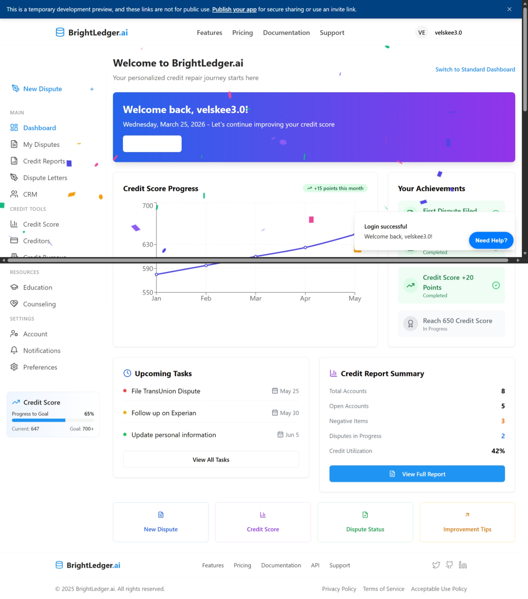

# BrightLedger.ai

BrightLedger.ai is an AI-powered financial and credit workflow platform designed to help users navigate a modern dashboard experience with cleaner account flows, guided access, and clear progress visibility.

## Overview
BrightLedger.ai is built to create a cleaner, more modern user experience for credit-related workflows, account access, and dashboard-based engagement.

## Problem
Many financial and credit-related platforms feel outdated, confusing, or fragmented. BrightLedger.ai is designed to offer a more guided, modern, and user-friendly experience.

## Who It’s For
- Individuals looking for a cleaner dashboard experience
- Users who need account access, login recovery, and guided workflow support
- Future clients, partners, or stakeholders evaluating the platform

## Current Status
Working prototype / MVP

## Core Features
- Landing page
- Login flow
- Create account flow
- Forgot username flow
- Forgot password flow
- Dashboard routing
- Branded user interface

## Live Demo
- Public Replit App: https://web-data-miner-velskee30.replit.app/
- Domain: https://brightledger.it.com

## Screenshots / Demo

### Login View

### Dashboard

### Firebase Authentication

### Firebase Project Overview

## Tech Stack
- Frontend: HTML, CSS, JavaScript
- Backend: JavaScript app logic
- Database: Firebase and linked local user/account data
- Auth: Firebase Authentication
- Hosting: Replit
- Domain: brightledger.it.com
- APIs/Services: Firebase Authentication, password reset flow, account recovery flows

## What’s Working Now
- Landing page
- Login flow
- Create account entry point
- Forgot password flow
- Forgot username support
- Firebase Authentication
- Authenticated dashboard access
- User-specific dashboard experience
- Domain presence

  ## Notes
BrightLedger.ai is currently a working prototype with a live branded landing page, Firebase Authentication, and confirmed authenticated dashboard access. Password reset is already built and active through the CreditRepairBot Firebase project.
